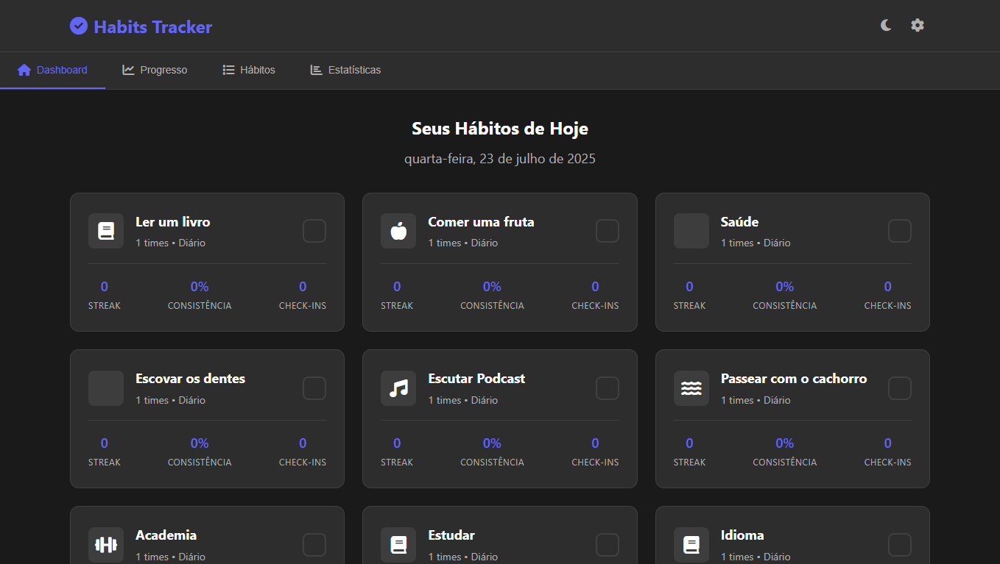
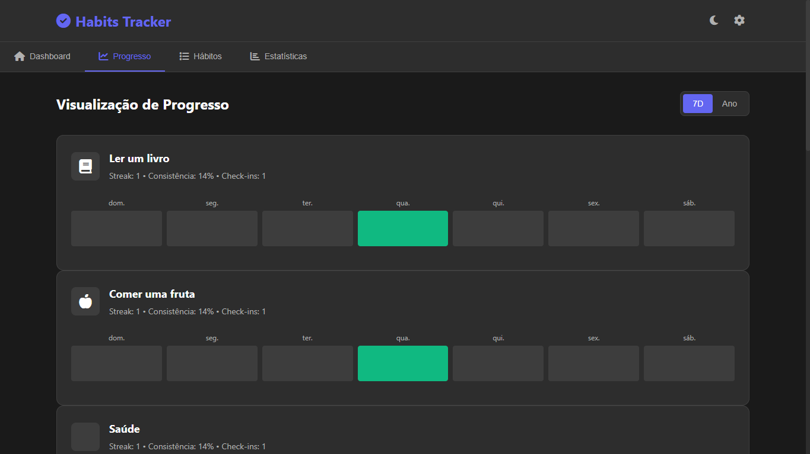
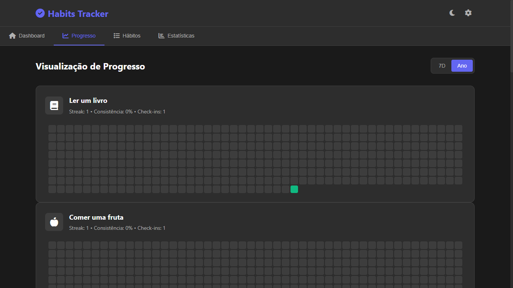
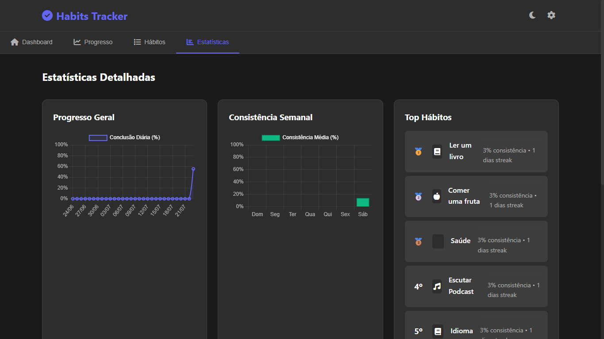

# Habits Tracker 🗓️

**Habits Tracker** é uma aplicação web simples para acompanhar e organizar seus hábitos diários. A proposta é ajudar no desenvolvimento pessoal por meio da criação de rotinas saudáveis e do monitoramento das tarefas concluídas diariamente.

## 🌐 Acesse o Projeto

Você pode acessar o projeto online clicando no link abaixo:

🔗 [Acesse o projeto online](https://habits-tracker-vert.vercel.app/)

## 📸 Print da Página

## 🛠️ Tecnologias Utilizadas

  

## Desenvolvedor

| [ Demetrius Vignati](https://github.com/demetriusvas) |
| :---: |